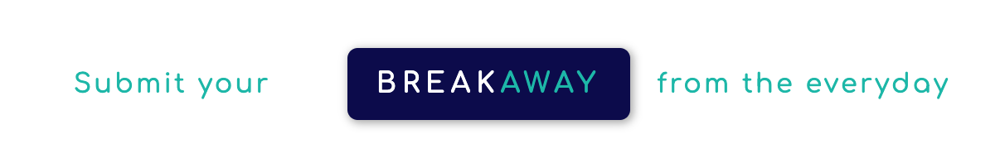
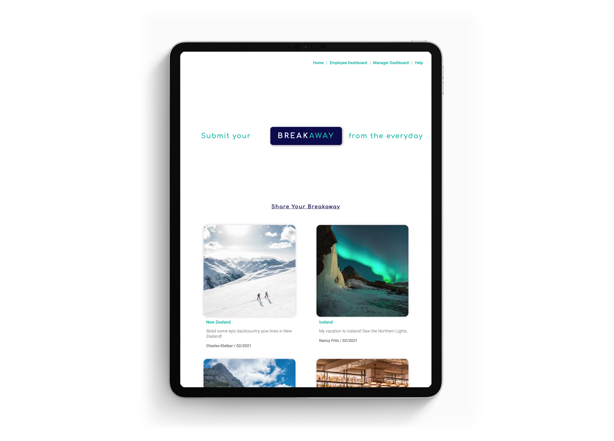
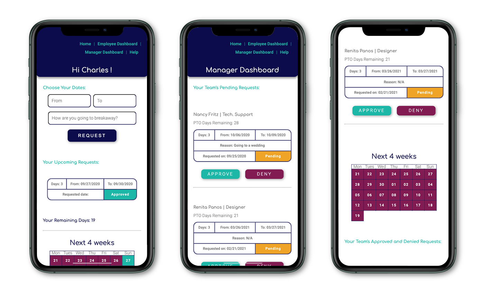

# Breakaway

  ## Table of Contents
  - [Project description and concept](#project-description)
  - [User story](#user-story)
  - [Installation](#installation)
  - [Features](#features)
  - [Application preview](#application-preview)
  - [Tech stack](#technology-and-framework)
  - [Contributing](#contributing)
  - [Questions and future development](#questions)
  - [License](#license)

  ## Project Description
  **Breakaway** is an app that increases productivity by helping create a culture and community of taking breaks. Track employee PTO and share employee experiences across your company with this fun and seamless user experience.

  ## Application Concept

  **Breakaway from the everyday**

  Taking time off from work is not only an opportunity to recharge, experience something new and connect with family and friends, it also leads to a healthier and happier life.  That allows us to be more productive at work, avoiding burnout and financial consequences for companies.

  According to [research](https://www.ustravel.org/sites/default/files/media_root/document/Paid%20Time%20Off%20Trends%20Fact%20Sheet.pdf?utm_source=MagnetMail&utm_medium=email&utm_content=8%2E15%2E19%2DPress%2DVacation%20Days%20Release&utm_campaign=pr) from the U.S. Travel Association, Oxford Economics, and Ipsos, Americans threw away a total of 768 million unused vacation days in 2018, which represents $65.5 billion in lost benefits.  This costs companies in the US [$224 Billion per year.](https://www.wsj.com/articles/BL-ATWORKB-2313)

  **Breakaway** helps companies to build a culture of balance in life, encouraging employees to use PTO, creating a more cohesive work environment where employees share their experiences and bond with their coworkers.

  [Try Breakaway now on Heroku](https://breakaway-vacay.herokuapp.com)

  

  ## User Story
  - - -
  - **As an Employer**
  - I want my employees to take time off and a tool to easily track PTO
  - So everyone have more job satisfaction be more productive, while the company keeps retention
  - - -
  - **As an Employee**
  - I want the process of requesting PTO to be as frictionless as possible, even fun
  - So that I feel supported in taking time off to recharge and maintain good health
  - - -

  ## Installation
  The **Breakaway** app is hosted on heroku, no special installation is required other than a web browser for mobile or desktop devices. ([**Google Chrome**](https://www.google.com/chrome/?brand=CHBD&gclid=Cj0KCQjwv7L6BRDxARIsAGj-34pI6kcGFGrZkxQgztLSwZZ7JzwQJFBfDBdgTHCurYEpg3QscMjHhYUaAkkjEALw_wcB&gclsrc=aw.ds) is recommended).

  ## Features
  - **Breakaway** will allow employees to request time off through a clean and clear interface
  - Managers can approve or deny a request through the manager portal
  - At the conclusion of vacation employees are encouraged to share a picture and a brief description of their vacation
  - All employees posted vacations will be displayed in a feed on the main page
  - So the company can celebrate together when employees take time off to recharge or have fun

  ## Application Preview

  

  

  ## Technology and Framework
  - Express
  - Handlebars
  - MySQL
  - Sequelize
  - Heroku with JawsDB
  - Multer
  - Cloudinary
  - Dotenv
  - Moment
  - Nodemailer

  ## Contributing
  - This project was created by [Jon](https://github.com/JonPhoenix), [Caleb](https://github.com/calebkirkish), [Luke](https://github.com/ShepLT1), [Dan](https://github.com/DanGillette25), and [Josh](https://github.com/zapponejosh/)
  - This app is licensed under the MIT licensing model.  Feel free to fork the repo or clone it locally to your machine and make whatever changes you'd like.

  ## Questions
  - Feel free to send a DM to any of the original contributors to this repo.

  ## Future Features

  - Differentiate between holidays, weekends and weekdays for requested time off
  - Ability for employee to update a previously submitted request
  - Get rid of using moment in favor of JavaScript date objects
  - Passwords, logins and session storage
  - Allow for likes and comments in the Breakaway feed
  
 ## License
   MIT

